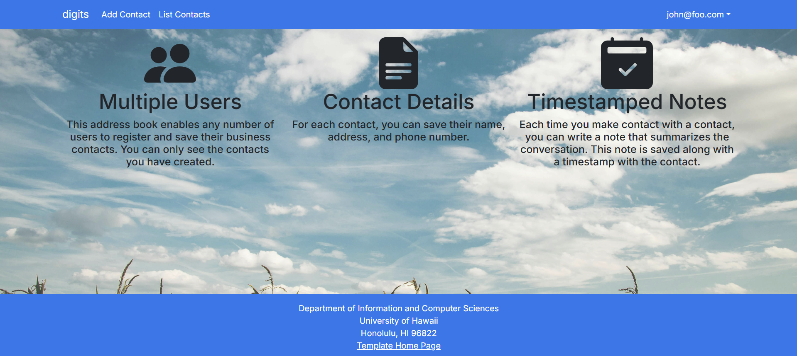

Digits is a project that allows users to register for an account and store and add contacts, as well as posting notes about them. All notes are timestamped so that you are able to track when you posted it. Only you can see your added contacts, and you may also put notes on them as well. An admin role is available to see all contacts added by all users. 

## Installation

First, [install PostgreSQL](https://www.postgresql.org/download/). Then create a database for your application.

```

$ createdb nextjs-application-template
Password:
$

```

Second, [download a copy of Digits](https://github.com/corveylee/digits). Since digits is currently a private repo, permission is only given to those that have contacted the owner. 

Third, cd into the app directory and install the libraries with 

```

$ npm install

```

Fifth, create a `.env` file from the `sample.env`. Set the `DATABASE_URL` variable to match your PostgreSQL database that you created in the first step. See the Prisma docs [Connect your database](https://www.prisma.io/docs/getting-started/setup-prisma/add-to-existing-project/relational-databases/connect-your-database-typescript-postgresql). Then run the Prisma migration `npx prisma migrate dev` to set up the PostgreSQL tables.

```

$ npx prisma migrate dev
Environment variables loaded from .env
Prisma schema loaded from prisma/schema.prisma
Datasource "db": PostgreSQL database "<your database name>", schema "public" at "localhost:5432"

Applying migration `20240708195109_init`

The following migration(s) have been applied:

migrations/
└─ 20240708195109_init/
└─ migration.sql

Your database is now in sync with your schema.

✔ Generated Prisma Client (v5.16.1) to ./node_modules/@prisma/client in 51ms

$

```

Then seed the database with the `/config/settings.development.json` data using `npx prisma db seed`.

```

$ npx prisma db seed
Environment variables loaded from .env
Running seed command `ts-node --compiler-options {"module":"CommonJS"} prisma/seed.ts` ...
Seeding the database
Creating user: admin@foo.com with role: ADMIN
Creating user: john@foo.com with role: USER
Adding contact: Philip Johnson
Adding contact: Henri Casanova
Adding contact: Kim Binstead
🌱 The seed command has been executed.
$

```

## Running the system

Once the libraries are installed and the database seeded, you can run the application by invoking the "dev" script in the [package.json file](https://github.com/ics-software-engineering/nextjs-application-template/blob/master/app/package.json):

```

$ npm run dev

> nextjs-application-template-1@0.1.0 dev
> next dev

▲ Next.js 14.2.4

- Local: http://localhost:3000
- Environments: .env

✓ Starting...
✓ Ready in 1619ms

```

## Walkthrough

The following sections describe the major features of this template.

### Directory structure

The top-level directory structure is:

```

.github # holds the GitHub Continuous Integration action and Issue template.

config/ # holds configuration files, such as settings.development.json

doc/ # holds developer documentation, user guides, etc.

prisma/ # holds the Prisma ORM schema and seed.ts files.

public/ # holds the public images.

src/ # holds the application files.

tests/ # holds the Playwright acceptance tests.

.eslintrc.json # The ESLint configuration.

.gitignore # don't commit VSCode settings files, node_modules, and settings.production.json

```

This structure separates documentation files (such as screenshots) and configuration files (such as the settings files) from the actual Next.js application.

The src/ directory has this structure:

```

app/

  add/ # The add route
    page.tsx # The Add Stuff Page

  admin/
    page.tsx # The Admin Page

  api/auth/[...nextauth]/
    route.ts # The NextAuth configuration

  auth/
    change-password/
      page.tsx # The Change Password Page

    signin/
      page.tsx # The Sign In Page

    signout/
      page.tsx # The Sign Out Page

    signup/
      page.tsx # The Sign Up / Register Page

  edit/
    page.tsx # The Edit Stuff Page

  list/
    page.tsx # The List Stuff Page

  not-authorized/
    page.tsx # The Not Authorized Page

  layout.tsx # The layout of the application

  page.tsx # The Landing Page

  providers.tsx # Session providers.

  components/
    AddStuffForm.tsx # The React Hook Form for adding stuff.

    EditStuffForm.tsx # The Edit Stuff Form.

    Footer.tsx # The application footer.

    LoadingSpinner.tsx # Indicates working.

    Navbar.tsx # The application navbar.

    StuffItem.tsx # Row in the list stuff page.

    StuffItemAdmin.tsx # Row in the admin list stuff page.

  lib/

    dbActions.ts # Functions to manipulate the Postgres database.

    page-protections.ts # Functions to check for logged in users and their roles.

    prisma.ts # Singleton Prisma client.

    validationSchemas.ts # Yup schemas for validating forms.

  tests/ # playwright acceptance tests.

```

### Application functionality

The application implements a simple CRUD application for managing "Stuff", which is a PostgreSQL table consisting of a name (String), a quantity (Number), a condition (one of 'excellent', 'good', 'fair', or 'poor') and an owner.

By default, each user only sees the Stuff that they have created. However, the settings file enables you to define default accounts. If you define a user with the role "admin", then that user gets access to a special page which lists all the Stuff defined by all users.

#### Landing page

When the application is opened, a landing page will explain all of the capabilities of the program.


The next step is to use the Login menu to either Login to an existing account or register a new account.

#### Login page

Clicking on the Login link, then on the Sign In menu item displays this page:


#### Register page

Alternatively, clicking on the Login link, then on the Sign Up menu item displays this page:


#### Landing (after Login) page, non-Admin user

Once you log in (either to an existing account or by creating a new one), the navbar changes as follows:


You can now add new contacts, list contacts, as well as add notes to each contact. 

#### Add Contact page

After logging in, here is the page that allows you to add new Contacts:


#### List Contact page

After logging in, here is the page that allows you to list all the Contacts you have created:


You click the "Edit" link to go to the Edit Contact page, shown next.

#### Edit Contact page

After clicking on the "Edit" link associated with an item, this page displays that allows you to change and save it:


#### Admin page (list all users stuff)

To provide a simple example of a "super power" for Admin users, the Admin page lists all of the Contacts by all of the users:


Note that non-admin users cannot get to this page, even if they type in the URL by hand.
